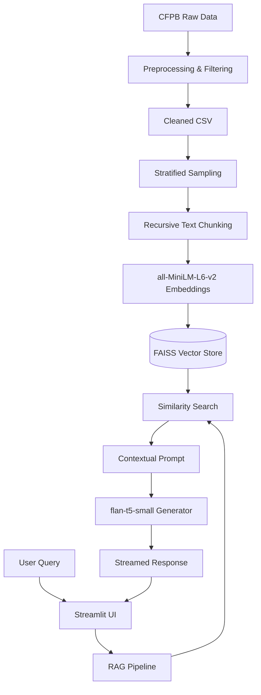

# 🛡️ CrediTrust: Advanced RAG Complaint Analyst

[](LICENSE)
[](https://share.streamlit.io/)
[](https://www.python.org/downloads/)

CrediTrust is an advanced **Retrieval-Augmented Generation (RAG)** system designed to analyze and interpret consumer financial complaints from the CFPB database. It combines high-performance vector retrieval with local Large Language Models (LLMs) to provide grounded, traceable, and insightful answers to complex consumer queries.

---

## 🚀 Key Features

- **Advanced RAG Pipeline**: Uses semantic search to retrieve the most relevant complaint snippets before generating answers.
- **Local LLM Execution**: Powered by `google/flan-t5-small`, ensuring data privacy and local processing.
- **Interactive Streamlit Dashboard**:
    - **Token-by-Token Streaming**: Experience real-time response generation.
    - **Contextual Memory**: Remembers previous message turns for natural dialogue.
    - **Traceability**: Click "View Sources" to see the exact Complaint IDs and text used for the answer.
    - **Admin Controls**: Dynamically adjust Retrieval K (Top-N) and monitor model status.
- **Production-Ready Structure**: Clean, modular code optimized for scalability and maintenance.

---

## 🏗️ Project Architecture



---

## 🛠️ Quick Start

### 1. Prerequisites
- Python 3.12 or higher
- Git

### 2. Installation
```bash
# Clone the repository
git clone https://github.com/meleseabrham/week-7-rag-complaint-chatbot.git
cd week-7-rag-complaint-chatbot

# Install dependencies
pip install -r requirements.txt
```

### 3. Data Preparation
The pipeline requires a pre-built FAISS index. If you need to rebuild it from scratch:
```bash
# Preprocess raw data
python src/preprocessing.py

# Build the vector store (indexing)
python src/indexing.py
```

### 4. Run the Chatbot
Launch the interactive advanced analyst:
```bash
python -m streamlit run app.py
```

---

## 📂 Repository Structure

- `app.py`: Main Streamlit application with advanced UI features.
- `src/`: Core logic modules.
    - `rag_pipeline.py`: RAG implementation (retrieval + generation + streaming).
    - `indexing.py`: Text chunking and FAISS vector store creation.
    - `preprocessing.py`: Data cleaning and stratified sampling.
- `vector_store/`: Persisted FAISS index files.
- `reports/`: Audit logs, interim reports, and qualitative evaluations.
- `notebooks/`: Exploratory Data Analysis (EDA) and pipeline prototypes.
- `tests/`: Unit tests for core processing logic.

---

## 📊 Evaluation Results
The system has been qualitatively evaluated across multiple financial domains.
Detailed findings can be found in [reports/task3_evaluation.md](reports/task3_evaluation.md).

---

## 🤝 Contributing
Contributions are welcome! Please follow the branching strategy:
- Create a `feature/` or `task/` branch for your changes.
- Submit a Pull Request for review.

---

## 📜 License
This project is licensed under the MIT License - see the LICENSE file for details.

---
**Developed for the Kifya Week 7 Challenge**
